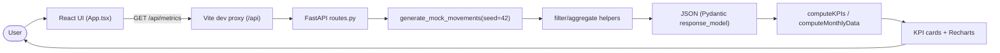

# Architecture

## Services and ports

- Frontend: React + TypeScript served by Vite on `5173` (`node:24-alpine`).
- Backend: FastAPI served by Uvicorn on `8000`, with debugpy on `5678`
  (`python:3.13-slim`).
- Orchestrated by Docker Compose ([../docker-compose.yml](../docker-compose.yml));
  `frontend` depends on `backend`.
- Connectivity: the Vite dev server proxies `/api` to `http://backend:8000`
  ([../frontend/vite.config.ts](../frontend/vite.config.ts)). The frontend can also
  target an absolute origin via `VITE_API_BASE_URL`.

## End-to-end data flow

Steps:

1. On mount, the frontend requests `/api/metrics`
   ([../frontend/src/App.tsx](../frontend/src/App.tsx)).
2. In dev, Vite forwards `/api` to the backend service.
3. The route generates deterministic movement data (`seed=42`), then applies
   optional server-side filters.
4. FastAPI serializes the response against a Pydantic `response_model`.
5. The frontend computes KPI aggregates and monthly chart points via pure utilities
   ([../frontend/src/lib/financial-utils.ts](../frontend/src/lib/financial-utils.ts)).
6. Dashboard components render KPI cards and charts, handling loading/error/empty
   states.

## Key structural pattern: separation of concerns

- Backend: pure, framework-free helpers (`filter_movements`,
  `summarize_movements`, `build_top_categories`, `calculate_net_value`,
  `detect_outcome_alerts`) are separate from thin route handlers
  ([../backend/app/routes.py](../backend/app/routes.py)).
- Frontend: business calculations live in `lib/` utilities, not in components.

This keeps logic unit-testable without a server or DOM. See the conventions in
[../.agents/rules/architecture.md](../.agents/rules/architecture.md).

## Component map (frontend)

- `App` -> `DashboardHeader`, `KPIRow` (-> `KPICard` x4),
  `IncomeOutcomeChart`, `ProfitPercentChart`.
- UI primitives: `components/ui/card.tsx`, `components/ui/skeleton.tsx`.
- Types: `lib/financial-types.ts`; utilities: `lib/financial-utils.ts`.

## Deeper context

- Frontend breakdown:
  [../docs/context/02-frontend-breakdown.md](../docs/context/02-frontend-breakdown.md)
- Backend breakdown:
  [../docs/context/03-backend-breakdown.md](../docs/context/03-backend-breakdown.md)
